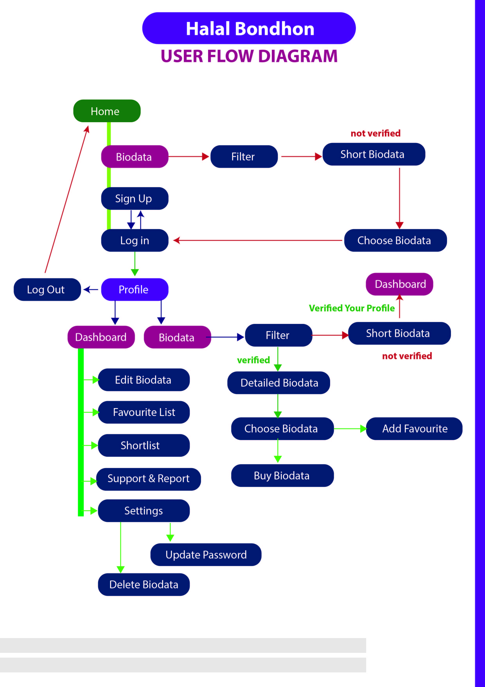

# 🎯 Halal Bondhon - University Matrimony Application

Welcome to **Halal Bondhon** — a university-centric matrimony platform crafted to help students connect with suitable life partners in a secure, and respectful way.

> 📌 **Team Name:** CoU_Visionary_Coders
>
> 👥 **Team Members:** 3 Members and Mentor

---

## 📋 Project Title
**💍 Halal Bondhon - A University Matrimony Application**

---

## 📝 Description
**Halal Bondhon** is a full-stack web application specifically tailored for university students seeking marriage within a culturally appropriate framework. It ensures only authenticated university students can create profiles, connect, and build meaningful bonds with potential partners.

---

## 🚀 Key Features
- 🔐 Secure Login and Signup with Email
- 🧑‍🎓 Student ID-Based Identity Verification
- 🧑‍💼 Create a verified Profile by submit university documents.
- 💍 Create Biodata using form with details information
- 🔎 Search, find and visit Biodata using filter
- 💡 Can See in Dashboard number of visitors
-   Total Number of Bride and Groom information
- ✨To view contact information, need biodata profile user validation
- 🛡️ Admin Dashboard for User Moderation
- 📱 Responsive UI for Small and Large Devices
- 🌙 Faith-Based, Safe Matrimony Experience

---

## 🛠️ Tech Stack

**Frontend**:
- ⚛️ React TypeScript
- 💨 Tailwind CSS

**Backend**:
- 🧩 Express.js
- 🍃 MongoDB

---

## 🔄 Functionality
- University Email Registration & JWT Authentication
- Upload Student ID for Verification
- View Verified Student Matches
- Filter and Finding Preferable Profile Biodata
- Admin Review & Approval of Profiles

---

## 👨‍💻 Team Info

| Name               | Role             | GitHub Profile                            |
|--------------------|------------------|--------------------------------------------|
| Member (Team Leader) | Full Stack     | [@shuvojr13](https://github.com/shuvojr13) |
| Member             | Full Stack       | [@suhel45](https://github.com/suhel45)     |
| Member             | Front-End        | [@mahmud803](https://github.com/mahmud803) |
| Mentor             | Guide & Reviewer | [@akib1997](https://github.com/akib1997)   |


---

## 🌍 Live Demo

🔗 **Live Link**: [View - Halal Bondhon](https://halal-bondhon.netlify.app)

---

## 🛠️ How to Clone and Run

### Prerequisites
- Node.js
- MongoDB Installed or Cloud Mongo URI

### 1️⃣ Clone the repository
```bash
git clone https://github.com/your-username/halal-bondhon.git
cd halal-bondhon
```

### 2️⃣ Run the Backend
```bash
cd server
npm install
npm run dev
```

### 3️⃣ Run the Frontend
```bash
cd client
npm install
npm run dev
```
## 🗂️ User Flow Diagram



---
## Resources
- [Project Documentation](docs/)
- [Development Setup](docs/setup.md)
- [Contributing Guidelines](CONTRIBUTING.md)
  
## 📬 Feedback
We welcome all kinds of constructive feedback and ideas to improve Halal Bondhon! Feel free to submit issues or pull requests.

---

> 💖 Made with sincerity and teamwork by **CoU_Visionary_Coders**

